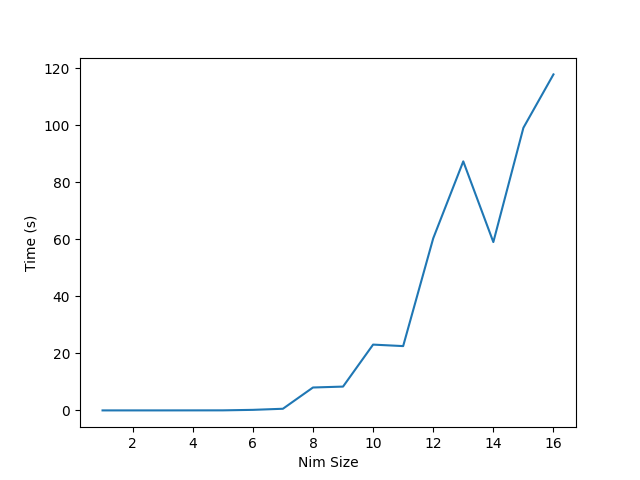
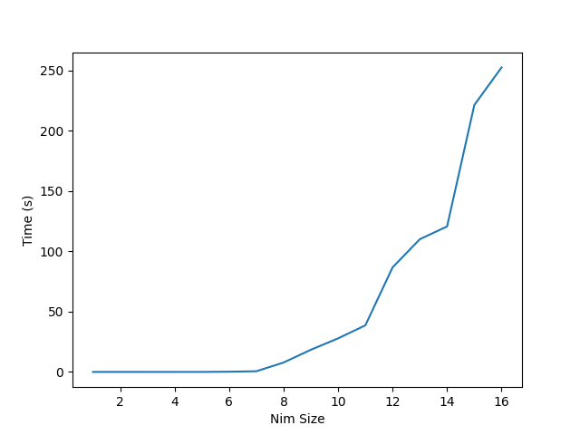

# Laboratory 3 part 2: Nim

## Task

Write agents able to play Nim, with an arbitrary number of rows and an upper bound  on the number of objects that can be removed in a turn (a.k.a., subtraction game).

The player taking the last object wins.

- Task 3.3: An agent using minMax.

## Explanation
The main challenge in an approach based on minMax is the dimension of the tree we create to explore all possible states. With four rows in the Nim game, the branching factor is too high to be fully explored without optimizations.
To reduce the computational cost, we used a dictionary to store the already visited states.\
The different optimizations we perform are:
 - After every nimming we reorder the rows in a descending order while removing also rows with zero objects in them. In this way we can maximize collisions of the dictionary's keys, so that we can reduce the total number of calculated states.
 - Alpha-beta pruning.

Given the extremely large branching factor, these optimizations alone are not sufficient to allow the program to run with any Nim's number of rows. So, we decided to introduce a depth limit in the exploration of the tree. After we reach the depth limit, we descend the tree randomly playing for a certain amount of moves, after which we restart the tree exploration with minMax. In this way we can explore a fair amount of states, without affecting too much computational cost. \
During our experiments we have seen that a depth limit of 200.000 states and 3 random moves allow us to beat the optimal player until number of rows = 10 in a fair amount of time. Increasing number of rows, the branching factor becomes too large to obtain significant results against the minMax, although we can win against less optimal strategies with larger number of rows.

In this graph we can see time required for playing the Nim game with increasing rows dimension with respect to depth limits.

|||
|:-:|:-:|
|Depth = 100k|Depth = 200k|
|  |  | 

## Contributors

- [Simone Mascali](https://github.com/vmask25)
- [Fabrizio Sulpizio](https://github.com/Xiusss)

Professor's repository took as reference: https://github.com/squillero/computational-intelligence